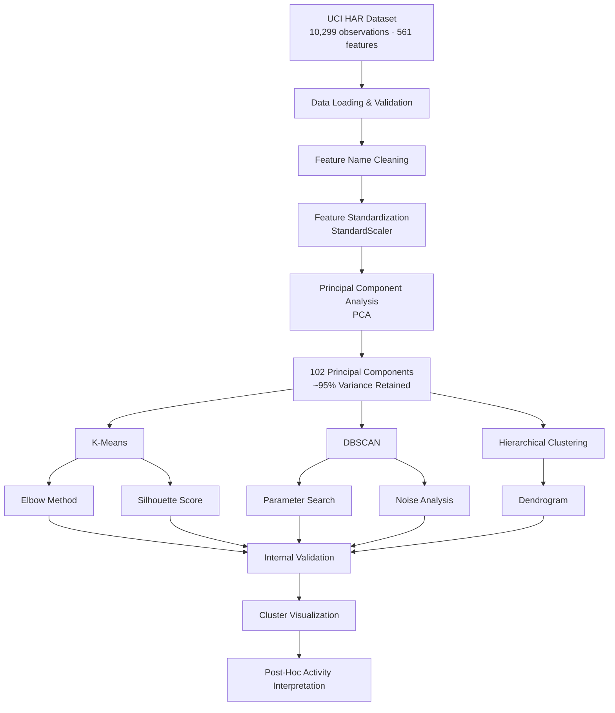
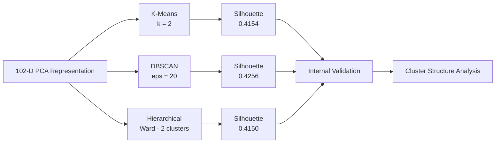
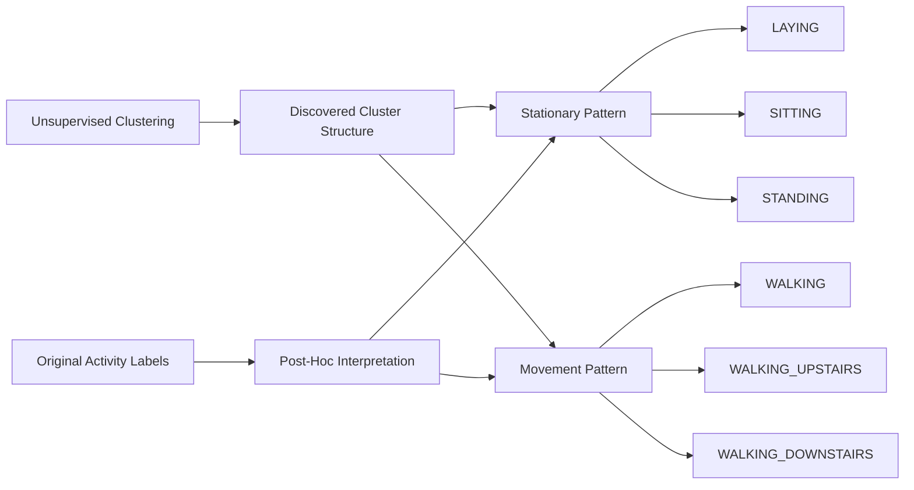
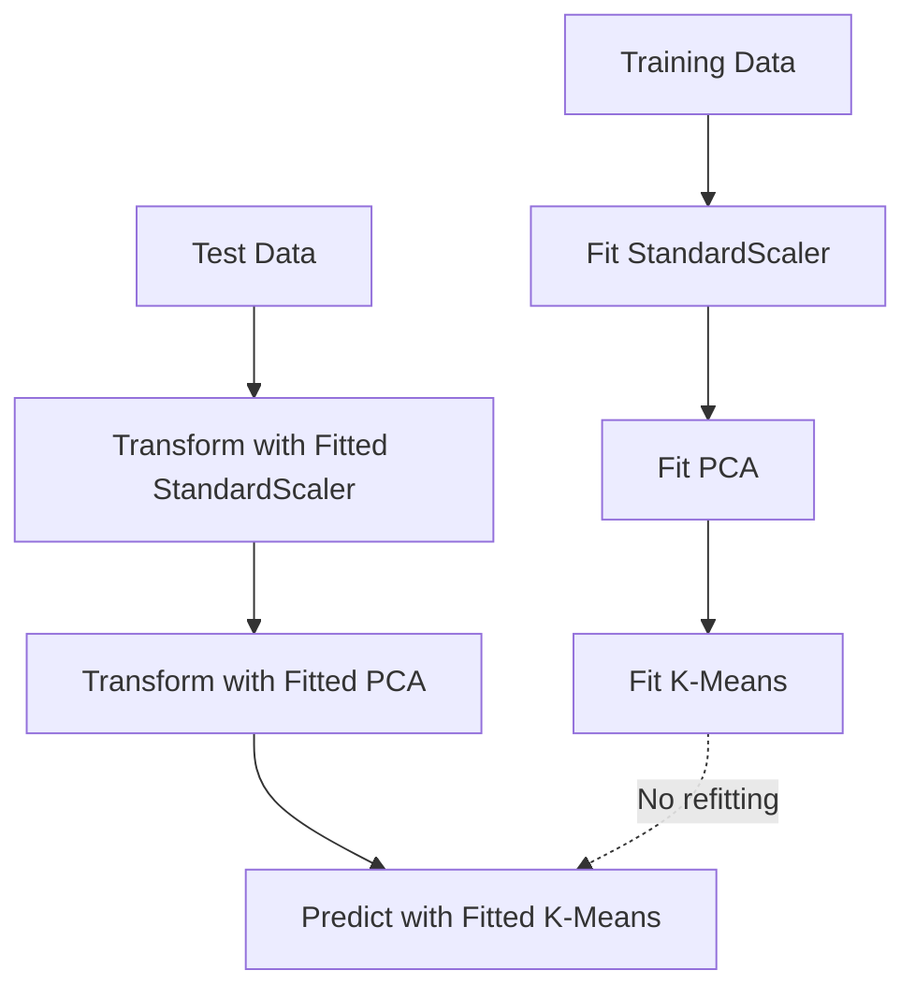

# 📊 Dimensionality Reduction & Unsupervised Clustering

An end-to-end **unsupervised machine learning project** exploring whether dimensionality reduction and clustering can reveal meaningful activity patterns in high-dimensional smartphone sensor data.

The project uses the **UCI Human Activity Recognition Using Smartphones (HAR)** dataset and applies:

* Feature standardization
* Principal Component Analysis (PCA)
* Explained variance analysis
* K-Means clustering
* Elbow Method
* Silhouette Score
* DBSCAN clustering
* Agglomerative Hierarchical Clustering
* Dendrogram analysis
* 2D and 3D visualization
* Internal clustering evaluation
* Post-hoc activity interpretation

---

## 🎯 Research Question

> **Can PCA and unsupervised clustering reveal meaningful activity patterns in high-dimensional smartphone sensor data?**

The activity labels are deliberately excluded from the clustering process. They are used only afterward to interpret the discovered cluster structure.

---

## 📌 Project Overview

High-dimensional sensor datasets can contain hundreds of correlated features, making direct analysis, visualization, and clustering difficult.

This project builds a reproducible pipeline that:

1. Loads and validates the UCI HAR dataset.
2. Standardizes the numerical sensor features.
3. Reduces dimensionality using PCA.
4. Evaluates multiple clustering algorithms.
5. Compares clusters using internal validation metrics.
6. Visualizes the discovered cluster structure.
7. Uses the original activity labels only for post-hoc interpretation.

---

## 🔄 Project Workflow



---

# 📂 Dataset

This project uses the **Human Activity Recognition Using Smartphones Dataset** from the UCI Machine Learning Repository.

### Dataset Characteristics

| Property           |                                        Value |
| ------------------ | -------------------------------------------: |
| Dataset            | Human Activity Recognition Using Smartphones |
| Total observations |                                       10,299 |
| Numerical features |                                          561 |
| Subjects           |                                           30 |
| Activities         |                                            6 |
| Missing values     |                                         None |
| Sampling frequency |                                        50 Hz |
| Sensor             |                          Samsung Galaxy S II |
| Data type          |                     Multivariate time-series |

### Activities

The dataset contains six predefined human activities:

* 🚶 WALKING
* 🚶 WALKING_UPSTAIRS
* 🚶 WALKING_DOWNSTAIRS
* 🪑 SITTING
* 🧍 STANDING
* 🛏️ LAYING

**Important:** These labels were not provided to the clustering algorithms. They were used only after clustering for interpretation.

### Dataset Source

**UCI Machine Learning Repository — Human Activity Recognition Using Smartphones**

[UCI HAR Dataset](https://archive.ics.uci.edu/dataset/240/human+activity+recognition+using+smartphones?utm_source=chatgpt.com)

---

# 🧹 Data Preparation

## 1. Data Loading

The original UCI train/test structure was preserved.

| Split    | Observations | Features |
| -------- | -----------: | -------: |
| Training |        7,352 |      561 |
| Testing  |        2,947 |      561 |
| Total    |       10,299 |      561 |

## 2. Data Validation

The dataset was checked for:

* Correct dimensions
* Missing values
* Duplicate feature names
* Feature consistency
* Numerical data types

The original `features.txt` contains duplicate feature names. These were resolved using unique suffixes while preserving all 561 features.

## 3. Feature Standardization

The sensor features were standardized using:

```python
StandardScaler()
```

The scaler was fitted **only on the training data** and subsequently applied to the test data.

This prevents information from the test set from influencing the preprocessing stage.

---

# 📉 Principal Component Analysis

PCA was applied after standardization to reduce the dimensionality of the original feature space.

### Dimensionality Reduction

```text
Original Feature Space
        │
        │ 561 features
        ▼
      PCA
        │
        │ ~95% variance retained
        ▼
102 Principal Components
```

### PCA Results

| Metric                | Result |
| --------------------- | -----: |
| Original dimensions   |    561 |
| Selected components   |    102 |
| Variance retained     |   ~95% |
| Training observations |  7,352 |
| Test observations     |  2,947 |

The resulting 102-dimensional representation was used for subsequent clustering experiments.

---

# 🔵 K-Means Clustering

K-Means was evaluated for:

```text
k = 2 → 10
```

Two approaches were used to assess the number of clusters:

### Elbow Method

The Elbow Method examines how within-cluster inertia changes as the number of clusters increases.

### Silhouette Score

Silhouette scores were calculated for each candidate value of `k`.

The selected configuration was:

```text
k = 2
Silhouette Score = 0.4154
```

### K-Means Configuration

| Parameter          |  Value |
| ------------------ | -----: |
| Number of clusters |      2 |
| Random state       |     42 |
| Initialization     |     10 |
| Silhouette Score   | 0.4154 |

The resulting two-cluster structure showed a broad separation between stationary and movement-related activity patterns during post-hoc interpretation.

---

# 🟣 DBSCAN Clustering

DBSCAN was evaluated across multiple `eps` values:

```text
eps = 3, 5, 7, 10, 15, 20
```

while keeping:

```text
min_samples = 5
```

The selected configuration was:

```text
eps = 20
min_samples = 5
```

### DBSCAN Results

| Metric             | Result |
| ------------------ | -----: |
| Clusters           |      2 |
| Noise observations |    159 |
| Noise percentage   |  2.16% |
| Silhouette Score   | 0.4256 |

The DBSCAN configuration produced the highest Silhouette Score among the evaluated clustering configurations.

---

# 🟢 Hierarchical Clustering

Agglomerative Hierarchical Clustering was applied using:

```text
n_clusters = 2
linkage = "ward"
```

### Results

| Metric           | Result |
| ---------------- | -----: |
| Clusters         |      2 |
| Linkage          |   Ward |
| Silhouette Score | 0.4150 |

A dendrogram was generated using a representative sample of 300 observations to make the hierarchical structure easier to inspect.

---

# 📊 Clustering Comparison

The three clustering approaches were evaluated using internal validation.

| Method       | Configuration           | Clusters | Noise | Silhouette |
| ------------ | ----------------------- | -------: | ----: | ---------: |
| K-Means      | `k=2`                   |        2 |     0 |     0.4154 |
| DBSCAN       | `eps=20, min_samples=5` |        2 |   159 | **0.4256** |
| Hierarchical | `Ward, n=2`             |        2 |     0 |     0.4150 |

Additional metrics, including:

* Calinski-Harabasz Score
* Davies-Bouldin Score

are calculated in the analysis notebook.

---

## 🔍 Clustering Evaluation



The Silhouette Score is an **internal clustering metric**. It measures mathematical cluster separation and should not be interpreted as direct evidence that the clusters perfectly represent real-world activity classes.

---

# 🧠 Post-Hoc Activity Interpretation

The known activity labels were deliberately excluded from the clustering process.

After clustering, they were used only to understand what the discovered clusters represented.

The K-Means solution showed a broad separation between:

### Stationary Activities

* LAYING
* SITTING
* STANDING

### Movement-Related Activities

* WALKING
* WALKING_UPSTAIRS
* WALKING_DOWNSTAIRS



These clusters should **not** be interpreted as replacements for the six predefined activity classes. They represent broader patterns discovered by the unsupervised algorithms.

---

# 📈 Visualizations

The project includes the following visual analyses.

### PCA

* Explained variance ratio
* Cumulative explained variance
* PCA scree plot

### K-Means

* Elbow Method
* Silhouette analysis
* 2D PCA cluster projection
* Cluster centroid visualization

### DBSCAN

* Parameter evaluation
* Noise analysis
* 2D PCA cluster visualization

### Hierarchical Clustering

* Dendrogram
* 2D PCA cluster projection

### Overall Analysis

* Cluster-size comparison
* Cluster vs. activity heatmap
* Interactive 3D PCA visualization using Plotly

All visualizations are available in:

```text
notebooks/dimensionality_reduction_clustering.ipynb
```

---

# 🔁 Reproducibility

The project uses a Python virtual environment and a documented dependency file.

## Requirements

Main dependencies include:

```text
numpy
pandas
scikit-learn
matplotlib
seaborn
plotly
scipy
jupyter
notebook
```

## Environment Setup

### 1. Create Virtual Environment

```powershell
py -3.12 -m venv .venv
```

### 2. Activate Environment

```powershell
.venv\Scripts\Activate.ps1
```

### 3. Install Dependencies

```powershell
pip install -r requirements.txt
```

### 4. Launch Jupyter Notebook

```powershell
jupyter notebook
```

Open:

```text
notebooks/dimensionality_reduction_clustering.ipynb
```

---

# ⚙️ Reproducibility Configuration

| Component              | Configuration    |
| ---------------------- | ---------------- |
| Standardization        | `StandardScaler` |
| PCA target             | ~95% variance    |
| PCA components         | 102              |
| K-Means                | `k=2`            |
| K-Means random state   | `42`             |
| K-Means initialization | `n_init=10`      |
| DBSCAN                 | `eps=20`         |
| DBSCAN                 | `min_samples=5`  |
| Hierarchical           | `n_clusters=2`   |
| Hierarchical linkage   | `Ward`           |

Fixed parameters and random seeds are used where applicable.

---

# 🧪 Test-Set Transformation

The test data is transformed using the same preprocessing pipeline fitted on the training data.



This prevents test data from influencing the fitted preprocessing or clustering model.

---

# 📁 Project Structure

```text
Dimensionality-Reduction-Clustering/
│
├── data/
│   ├── raw/
│   │   └── UCI HAR Dataset/
│   ├── interim/
│   └── processed/
│
├── notebooks/
│   └── dimensionality_reduction_clustering.ipynb
│
├── reports/
│   └── final_results.md
│
├── src/
│
├── tests/
│
├── .gitignore
├── README.md
└── requirements.txt
```

Raw, interim, and processed dataset files are excluded from Git where appropriate.

---

# 🔑 Key Findings

### PCA

The original **561-dimensional** feature space was reduced to **102 principal components**, retaining approximately **95% of the variance**.

### K-Means

```text
k = 2
Silhouette = 0.4154
```

### DBSCAN

```text
eps = 20
min_samples = 5
clusters = 2
noise = 159 observations
Silhouette = 0.4256
```

### Hierarchical Clustering

```text
n_clusters = 2
linkage = Ward
Silhouette = 0.4150
```

### Interpretation

The unsupervised analysis identified broad structure separating stationary and movement-related activity patterns during post-hoc interpretation. The discovered clusters should not be treated as exact equivalents of the six predefined activity classes.

---

# ⚠️ Limitations

* Clustering was primarily evaluated on the training portion of the dataset.
* PCA retains approximately 95% of the original variance, meaning some information is discarded.
* DBSCAN is sensitive to parameters such as `eps` and `min_samples`.
* The hierarchical dendrogram uses a representative sample of 300 observations.
* The discovered clusters do not necessarily correspond exactly to all six predefined activity classes.
* Activity labels were used only for post-hoc interpretation.
* Internal clustering metrics measure mathematical cluster separation, not necessarily semantic correctness.
* A higher Silhouette Score alone does not establish that a clustering solution is more meaningful in a real-world application.

---

# 🛠️ Tech Stack

| Category                 | Tools                                     |
| ------------------------ | ----------------------------------------- |
| Language                 | Python                                    |
| Data Processing          | Pandas, NumPy                             |
| Dimensionality Reduction | Scikit-learn PCA                          |
| Clustering               | K-Means, DBSCAN, Agglomerative Clustering |
| Statistics               | SciPy                                     |
| Visualization            | Matplotlib, Seaborn, Plotly               |
| Development              | Jupyter Notebook                          |
| Environment              | Python Virtual Environment                |
| Dataset                  | UCI HAR                                   |

---

# 📚 Project Learning Outcomes

Through this project, the following concepts were implemented:

* High-dimensional feature analysis
* Feature standardization
* PCA and explained variance
* Unsupervised learning
* K-Means clustering
* Density-based clustering
* Hierarchical clustering
* Cluster validation
* Silhouette analysis
* Noise detection
* Dendrogram interpretation
* Dimensionality-reduced visualization
* Post-hoc cluster interpretation
* Reproducible ML workflows
* Train/test preprocessing discipline

---

# 👨‍💻 Author

**Deban Kumar Das D**

BCA — Data Science

GitHub: [@Debankumardas](https://github.com/Debankumardas)

---

## 📄 License

This project is intended for educational and portfolio purposes.

The dataset is provided by the **UCI Machine Learning Repository** under its applicable dataset terms.

---

⭐ If you found this project useful, consider starring the repository.
